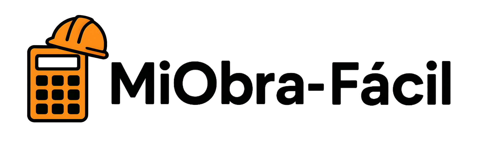

<div align="center"><div align="center"><div align="center">

  

    

  <h1>Mi Obra Fácil</h1>

      

  <p>Aplicación móvil para calcular presupuestos de construcción en Bolivia</p>

  <p>Precios actualizados según catálogo P&C Enlace 07 (Junio 2025)</p>  # Mi Obra Fácil

</div>

    

---

  Aplicación móvil para calcular presupuestos de construcción en Bolivia

## Descripción

    # Mi Obra Fácil

Mi Obra Fácil es una herramienta diseñada para profesionales de la construcción en Bolivia que permite crear presupuestos detallados con precios diferenciados por región. La aplicación incluye un catálogo completo de 97 partidas basadas en el documento P&C Enlace 07 de junio 2025.

  Precios actualizados según catálogo P&C Enlace 07 (Junio 2025)

## Características

</div>  Aplicación móvil para calcular presupuestos de construcción en Bolivia, con precios actualizados según catálogo P&C Enlace 07 (Junio 2025).

- Gestión completa de proyectos de construcción

- Catálogo de 97 partidas organizadas en 15 categorías

- Precios diferenciados para La Paz, Cochabamba y Santa Cruz

- Calculadora integrada para estimaciones rápidas---  **Aplicación móvil para calcular presupuestos de construcción en Bolivia**

- Dashboard con estadísticas de proyectos

- Exportación de presupuestos a PDF

- Almacenamiento local con Hive (sin necesidad de internet)

## Descripción  

## Instalación


### Opción 1: Descarga Directa

Mi Obra Fácil es una herramienta diseñada para profesionales de la construcción en Bolivia que permite crear presupuestos detallados con precios diferenciados por región. La aplicación incluye un catálogo completo de 97 partidas basadas en el documento P&C Enlace 07 de junio 2025.  Precios actualizados según catálogo P&C Enlace 07 (Junio 2025)

1. Ve a [Releases](https://github.com/CubeFreaKLab/MiObra-Facil/releases)

2. Descarga el archivo APK más reciente

3. Instala en tu dispositivo Android

## Características Principales</div>## DescripciónAplicación móvil para calcular presupuestos de construcción en Bolivia, con precios actualizados según catálogo P&C Enlace 07 (Junio 2025).<div align="center">

Para más detalles consulta [INSTALACION.md](INSTALACION.md)


### Opción 2: Compilar desde Código Fuente

- Gestión de Proyectos: Crea y administra múltiples proyectos de construcción

**Requisitos:**

- Flutter SDK 3.35.7 o superior- Catálogo P&C Completo: 97 partidas organizadas en 15 categorías

- Dart SDK 3.9.2 o superior

- Android Studio con SDK 36.0.0- Precios Diferenciados: Cotizaciones para La Paz, Cochabamba y Santa Cruz---


**Pasos:**- Calculadora Integrada: Herramienta para estimaciones rápidas


```bash- Dashboard Estadístico: Visualización de estadísticas de proyectos

git clone https://github.com/CubeFreaKLab/MiObra-Facil.git

cd MiObra-Facil- Exportación a PDF: Genera presupuestos profesionales

flutter pub get

flutter run- Persistencia Local: Base de datos Hive para almacenamiento offline## Descripción**Mi Obra Fácil** es una herramienta diseñada para profesionales de la construcción en Bolivia que permite crear presupuestos detallados con precios diferenciados por región. La aplicación incluye un catálogo completo de 97 partidas basadas en el documento P&C Enlace 07 de junio 2025.

```


**Compilar APK:**

## Instalación

```bash

# Windows

build-release.bat

### Descarga Directa (Recomendado)Mi Obra Fácil es una herramienta diseñada para profesionales de la construcción en Bolivia que permite crear presupuestos detallados con precios diferenciados por región. La aplicación incluye un catálogo completo de 97 partidas basadas en el documento P&C Enlace 07 de junio 2025.

# Linux/macOS

chmod +x build-release.sh

./build-release.sh

```1. Ve a [Releases](https://github.com/CubeFreaKLab/MiObra-Facil/releases)


## Tecnologías2. Descarga el archivo APK de la versión más reciente


- Flutter 3.35.73. Instala en tu dispositivo Android## Características Principales## Características Principales## ✨ Características

- Dart 3.9.2

- Material Design 3

- Provider 6.0.5

- Hive 2.2.3Para más detalles consulta [INSTALACION.md](INSTALACION.md)

- Go Router 14.0.0

- PDF 3.10.8

- Printing 5.12.0

### Compilación desde Código Fuente- **Gestión de Proyectos**: Crea y administra múltiples proyectos de construcción con detalles completos

## Estructura del Proyecto


```

MiObra-Facil/Requisitos:- **Catálogo P&C Completo**: 97 partidas organizadas en 15 categorías según el estándar P&C Enlace 07

├── lib/

│   ├── main.dart- Flutter SDK 3.35.7 o superior

│   ├── router.dart

│   ├── data/- Dart SDK 3.9.2 o superior- **Precios Diferenciados**: Cotizaciones específicas para La Paz, Cochabamba y Santa Cruz- **Catálogo completo**: 97 partidas organizadas en 15 categorías

│   ├── models/

│   ├── providers/- Android Studio con SDK 36.0.0

│   ├── screens/

│   ├── widgets/- **Calculadora Integrada**: Herramienta de cálculo incorporada para estimaciones rápidas

│   └── pdf_export_helper.dart

├── assets/Pasos:

├── android/

└── pubspec.yaml- **Dashboard Estadístico**: Visualización de estadísticas de proyectos con totales y promedios- **Precios regionales**: Tarifas diferenciadas para La Paz, Cochabamba y Santa Cruz

```

```bash

## Catálogo P&C

git clone https://github.com/CubeFreaKLab/MiObra-Facil.git- **Exportación a PDF**: Genera presupuestos profesionales con encabezado corporativo

97 partidas organizadas en 15 categorías:

cd MiObra-Facil

1. Trabajos Preliminares (11 items)

2. Movimiento de Tierras (5 items)flutter pub get- **Persistencia Local**: Base de datos Hive para almacenamiento offline- **Almacenamiento local**: Base de datos Hive NoSQL para persistencia offline- 📊 **Catálogo completo**: 97 partidas organizadas en 15 categorías (trabajos preliminares, movimiento de tierras, obras gruesas, obras finas, carpintería)**Aplicación profesional para presupuestos de construcción en Bolivia**

3. Obra Gruesa - Cimentación (10 items)

4. Obra Gruesa - Estructura (12 items)flutter run

5. Obra Gruesa - Muros (6 items)

6. Obra Gruesa - Cubiertas (10 items)```

7. Obra Fina - Cielorrasos (2 items)

8. Obra Fina - Revestimientos (10 items)

9. Obra Fina - Techos (3 items)

10. Obra Fina - Pisos (9 items)Para compilar APK de release:## Instalación- **Exportación PDF**: Genera presupuestos profesionales con logotipo personalizado

11. Obra Fina - Canalización (3 items)

12. Obra Fina - Impermeabilización (2 items)

13. Obra Fina - Pintura (7 items)

14. Carpintería (3 items)```bash

15. Mesones y Topes (1 item)

# Windows

## Uso

build-release.bat### Opción 1: Descarga Directa (Recomendado)- **Dashboard estadístico**: Visualiza métricas de tus proyectos- 🗺️ **Precios regionales**: Tarifas diferenciadas para La Paz, Cochabamba y Santa Cruz

**Crear Proyecto:**

1. Toca el botón (+) en Proyectos

2. Completa los datos

3. Guarda# Linux/macOS


**Agregar Partidas:**chmod +x build-release.sh

1. Abre el proyecto

2. Toca "Agregar Item"./build-release.sh1. Ve a la sección [Releases](https://github.com/CubeFreaKLab/MiObra-Facil/releases)- **Calculadora integrada**: Herramienta rápida para cálculos

3. Selecciona categoría y partida

4. Ingresa cantidad```


**Generar PDF:**2. Descarga el archivo APK de la versión más reciente

1. Desde el detalle del proyecto

2. Toca el icono de PDF## Tecnologías

3. Comparte o imprime

3. Instala en tu dispositivo Android (permite instalación desde fuentes desconocidas)- **Material Design 3**: Interfaz moderna con paleta de colores naranja y azul- 💾 **Almacenamiento local**: Todos tus proyectos guardados en tu dispositivo con Hive[](https://flutter.dev)

## Contribuir

- Flutter 3.35.7

Las contribuciones son bienvenidas:

- Dart 3.9.2

1. Fork el proyecto

2. Crea una rama: `git checkout -b feature/nueva-funcionalidad`- Material Design 3

3. Commit: `git commit -m 'Agregar funcionalidad'`

4. Push: `git push origin feature/nueva-funcionalidad`- Provider 6.0.5Para instrucciones detalladas, consulta [INSTALACION.md](INSTALACION.md)

5. Abre Pull Request

- Hive 2.2.3

Ver [CONTRIBUTING.md](CONTRIBUTING.md) para más detalles.

- Go Router 14.0.0

## Licencia

- PDF 3.10.8

MIT License. Ver [LICENSE](LICENSE) para más información.

- Printing 5.12.0### Opción 2: Compilación desde Código Fuente## Capturas de Pantalla- 📄 **Exportación PDF**: Genera presupuestos profesionales con tu logotipo[](https://dart.dev)

## Autores


**Oxidizerhack & CubeFreakLab**

## Catálogo P&C

- GitHub Oxidizerhack: [@Oxidizerhack](https://github.com/Oxidizerhack)

- GitHub CubeFreakLab: [@CubeFreakLab](https://github.com/CubeFreaKLab)

- Repositorio: [MiObra-Facil](https://github.com/CubeFreaKLab/MiObra-Facil)

97 partidas organizadas en 15 categorías:**Requisitos:**

## Contacto


Para reportar bugs o hacer preguntas, abre un [issue](https://github.com/CubeFreaKLab/MiObra-Facil/issues).

1. Trabajos Preliminares (11 items)- Flutter SDK 3.35.7 o superior

---

2. Movimiento de Tierras (5 items)

<div align="center">

  <p>Mi Obra Fácil - Simplificando la gestión de proyectos de construcción en Bolivia</p>3. Obra Gruesa - Cimentación (10 items)- Dart SDK 3.9.2 o superior_Próximamente_- 📈 **Dashboard**: Visualiza estadísticas de tus proyectos[](LICENSE)

</div>

4. Obra Gruesa - Estructura (12 items)

5. Obra Gruesa - Muros (6 items)- Android Studio con SDK 36.0.0

6. Obra Gruesa - Cubiertas (10 items)

7. Obra Fina - Cielorrasos (2 items)- Android NDK 27.0.12077973

8. Obra Fina - Revestimientos (10 items)

9. Obra Fina - Techos (3 items)

10. Obra Fina - Pisos (9 items)

11. Obra Fina - Canalización (3 items)**Pasos:**## Instalación- 🧮 **Calculadora integrada**: Herramienta rápida para cálculos básicos[](https://www.android.com)

12. Obra Fina - Impermeabilización (2 items)

13. Obra Fina - Pintura (7 items)

14. Carpintería (3 items)

15. Mesones y Topes (1 item)```bash


Cada partida incluye precio diferenciado por región.# Clonar repositorio


## Usogit clone https://github.com/CubeFreaKLab/MiObra-Facil.git### Opción 1: APK Precompilado- 🎨 **Diseño moderno**: Material Design 3 con colores naranja (#FF6B35) y azul (#004E89)


**Crear Proyecto:**cd MiObra-Facil

- Toca el botón (+) en Proyectos

- Completa los datos

- Guarda

# Instalar dependencias

**Agregar Partidas:**

- Abre el proyectoflutter pub get1. Descarga el APK desde [Releases](../../releases)</div>

- Toca "Agregar Item"

- Selecciona categoría y partida

- Ingresa cantidad

# Ejecutar aplicación2. Habilita instalación de fuentes desconocidas en tu dispositivo

**Generar PDF:**

- Desde el detalle del proyectoflutter run

- Toca el icono de PDF

- Comparte o imprime3. Instala el APK descargado


## Contribuir# Compilar APK de release (Windows)


1. Haz fork del proyectobuild-release.bat4. Abre la aplicación

2. Crea una rama: `git checkout -b feature/nueva-funcionalidad`

3. Haz commit: `git commit -m 'Agregar funcionalidad'`

4. Push: `git push origin feature/nueva-funcionalidad`

5. Abre Pull Request# Compilar APK de release (Linux/macOS)## 📋 Descripción


Ver [CONTRIBUTING.md](CONTRIBUTING.md) para más detalles.chmod +x build-release.sh


## Licencia./build-release.sh### Opción 2: Compilar desde Código Fuente


MIT License. Ver [LICENSE](LICENSE) para más información.```


## Contacto## 🚀 Instalación en tu Celular


Para bugs o preguntas abre un [issue](https://github.com/CubeFreaKLab/MiObra-Facil/issues).El APK se genera en: `build/app/outputs/flutter-apk/app-release.apk`


---#### Requisitos Previos


<div align="center">## Tecnologías Utilizadas

  Mi Obra Fácil - Simplificando la gestión de proyectos de construcción

</div>**Mi Obra Fácil** es una aplicación móvil diseñada para profesionales de la construcción en Bolivia que permite:


**Framework y Lenguaje:**

- Flutter 3.35.7- Flutter SDK 3.35.7 o superior

- Dart 3.9.2

- Material Design 3- Android SDK con NDK 27.0.12077973### Opción 1: Instalar APK Directamente (Recomendado)


**Gestión de Estado:**- Android Studio o VS Code

- provider 6.0.5

- Dispositivo Android físico o emulador- ✅ Crear presupuestos de obra detallados

**Persistencia:**

- hive 2.2.3

- hive_flutter 1.1.0

- path_provider 2.1.4#### Pasos de Instalación1. **Descarga el APK** desde la sección [Releases](../../releases)- 📊 Visualizar estadísticas y análisis de costos


**Navegación:**

- go_router 14.0.0

```bash2. **Activa instalación de fuentes desconocidas**:- 💾 Guardar proyectos localmente con persistencia

**Generación de PDF:**

- pdf 3.10.8# Clonar repositorio

- printing 5.12.0

git clone https://github.com/Oxidizerhack/MiObra-Facil.git   - Ajustes → Seguridad → Habilitar "Fuentes desconocidas"- 📄 Exportar presupuestos en formato PDF

**Utilidades:**

- intl 0.19.0cd MiObra-Facil

- json_annotation 4.9.0

   - O cuando intentes instalar, Android te pedirá permiso- 🌍 Calcular precios según región (La Paz, Cochabamba, Santa Cruz)

**Desarrollo:**

- build_runner 2.4.13# Instalar dependencias

- json_serializable 6.8.0

- flutter_lints 5.0.0flutter pub get3. **Instala el APK** desde tus descargas- 🏗️ Gestionar 26 tipos de trabajos en 3 categorías


**Assets Nativos:**

- flutter_native_splash 2.4.4

- flutter_launcher_icons 0.13.1# Verificar dispositivo conectado4. **¡Listo!** Abre la app y comienza a crear presupuestos


## Estructura del Proyectoflutter devices


```---

MiObra-Facil/

├── lib/# Ejecutar aplicación

│   ├── main.dart

│   ├── router.dartflutter run### Opción 2: Compilar desde el Código Fuente

│   ├── data/

│   │   ├── work_catalog.dart```

│   │   └── work_types.dart

│   ├── models/## ✨ Características Principales

│   │   ├── project_model.dart

│   │   ├── job_model.dart#### Compilar APK de Producción

│   │   └── work_type_model.dart

│   ├── providers/#### Requisitos

│   │   ├── project_provider.dart

│   │   └── region_provider.dart```bash

│   ├── screens/

│   │   ├── home_screen.dart# Generar APK release### 🎯 Gestión de Proyectos

│   │   ├── dashboard_screen.dart

│   │   ├── calculator_screen.dartflutter build apk --release

│   │   ├── add_project_screen.dart

│   │   ├── edit_project_screen.dart- Flutter SDK 3.35.7 o superior- **CRUD Completo**: Crear, leer, actualizar y eliminar proyectos

│   │   ├── project_detail_screen.dart

│   │   └── select_item_screen.dart# El APK se encontrará en:

│   ├── widgets/

│   │   └── custom_cards.dart# build/app/outputs/flutter-apk/app-release.apk- Android Studio o VS Code- **Información Detallada**: Nombre del proyecto, cliente, región

│   └── pdf_export_helper.dart

├── assets/```

│   ├── images/

│   └── icons/- Android SDK con NDK 27.0.12077973- **Partidas Personalizables**: Agregar y eliminar trabajos específicos

├── android/

├── .github/workflows/Alternativamente, puede usar los scripts proporcionados:

├── pubspec.yaml

├── README.md- Dispositivo Android o emulador- **Cálculo Automático**: Totales por categoría y proyecto

├── LICENSE

├── CONTRIBUTING.md**Windows:**

├── INSTALACION.md

├── build-release.bat```cmd

└── build-release.sh

```build-release.bat


## Catálogo P&C Enlace 07```#### Pasos### 📊 Dashboard Analítico


La aplicación incluye 97 partidas actualizadas según el documento oficial P&C Enlace 07 de junio 2025, organizadas en 15 categorías:


1. **Trabajos Preliminares** (11 items)**Linux/macOS:**- **Estadísticas Generales**: Total de proyectos, costos totales

2. **Movimiento de Tierras** (5 items)

3. **Obra Gruesa - Cimentación** (10 items)```bash

4. **Obra Gruesa - Estructura** (12 items)

5. **Obra Gruesa - Muros** (6 items)./build-release.sh```bash- **Gráficos por Categoría**: Obra Gruesa, Obra Fina, Instalaciones

6. **Obra Gruesa - Cubiertas** (10 items)

7. **Obra Fina - Cielorrasos** (2 items)```

8. **Obra Fina - Revestimientos** (10 items)

9. **Obra Fina - Techos** (3 items)# 1. Clona el repositorio- **Desglose Regional**: Análisis de costos por departamento

10. **Obra Fina - Pisos** (9 items)

11. **Obra Fina - Canalización** (3 items)## Tecnologías

12. **Obra Fina - Impermeabilización** (2 items)

13. **Obra Fina - Pintura** (7 items)git clone https://github.com/Oxidizerhack/MiObra-Facil.git- **Top 3 Proyectos**: Ranking de proyectos más costosos

14. **Carpintería** (3 items)

15. **Mesones y Topes** (1 item)### Framework y Lenguaje


Cada partida incluye descripción detallada, unidad de medida y precio diferenciado por región (La Paz, Cochabamba, Santa Cruz).- **Flutter** 3.35.7 - Framework multiplataformacd MiObra-Facil


## Uso- **Dart** 3.9.2 - Lenguaje de programación


**Seleccionar Región:**### 💾 Persistencia de Datos

- Usa el selector de región para elegir entre La Paz, Cochabamba o Santa Cruz

### Dependencias Principales

**Crear Proyecto:**

- Toca el botón flotante (+) en la pantalla de Proyectos# 2. Instala dependencias- **Base de Datos Local**: Implementación con Hive

- Completa los datos del proyecto

- Guarda el proyecto```yaml


**Agregar Partidas:**dependencies:flutter pub get- **Almacenamiento Eficiente**: Sin conexión a internet requerida

- Abre el proyecto

- Toca "Agregar Item"  flutter:

- Selecciona categoría y partida

- Ingresa la cantidad    sdk: flutter- **TypeAdapters Generados**: Serialización automática


**Generar Presupuesto:**  hive: ^2.2.3                    # Base de datos NoSQL

- Desde el detalle del proyecto, toca el icono de PDF

- Comparte o imprime el presupuesto generado  hive_flutter: ^1.1.0            # Integración Hive-Flutter# 3. Conecta tu dispositivo Android (modo desarrollador activado)


**Dashboard:**  provider: ^6.0.5                # Gestión de estado

- Visualiza estadísticas generales y proyectos destacados

  go_router: ^14.0.0              # Sistema de navegaciónflutter devices### 🎨 Interfaz Moderna

**Calculadora:**

- Herramienta para cálculos rápidos  pdf: ^3.10.8                    # Generación de PDFs


## Contribuir  printing: ^5.12.0               # Impresión y vista previa- **Material Design 3**: UI/UX actualizado


Las contribuciones son bienvenidas. Para contribuir:  path_provider: ^2.1.5           # Acceso a directorios del sistema


1. Haz fork del proyecto  intl: ^0.18.1                   # Internacionalización# 4. Ejecuta la app- **Splash Screen Personalizado**: Logo y fondo de marca (3 segundos)

2. Crea una rama: `git checkout -b feature/nueva-funcionalidad`

3. Realiza tus cambios: `git commit -m 'Agregar nueva funcionalidad'````

4. Sube los cambios: `git push origin feature/nueva-funcionalidad`

5. Abre un Pull Requestflutter run- **Tema Personalizado**: Colores naranja (#FF6B35) y azul (#004E89)


Consulta [CONTRIBUTING.md](CONTRIBUTING.md) para más detalles.### Arquitectura


## Licencia```- **Modo Oscuro**: Soporte para tema claro y oscuro


Este proyecto está bajo la Licencia MIT. Consulta [LICENSE](LICENSE) para más detalles.- **Patrón de diseño**: Provider para gestión de estado


## Contacto- **Base de datos**: Hive (NoSQL, almacenamiento local)


Para preguntas o reportes de bugs, abre un [issue](https://github.com/CubeFreaKLab/MiObra-Facil/issues) en GitHub.- **Navegación**: go_router con rutas declarativas


## Agradecimientos- **Generación PDF**: dart_pdf con formato personalizado#### Compilar APK para instalación### 📄 Exportación PDF


Datos de precios basados en P&C Enlace 07 (Junio 2025).


Desarrollado para profesionales de la construcción en Bolivia.## Estructura del Proyecto- **Presupuestos Profesionales**: Generación de PDF detallado


---


<div align="center">``````bash- **Formato Boliviano**: Adaptado a estándares locales

  <p><strong>Mi Obra Fácil</strong> - Simplificando la gestión de proyectos de construcción</p>

</div>lib/


├── main.dart                       # Punto de entrada# APK de producción (release)- **Logo y Marca**: Documentos personalizados

├── router.dart                     # Configuración de rutas

├── pdf_export_helper.dart          # Lógica de exportación PDFflutter build apk --release

├── data/

│   ├── work_catalog.dart           # Catálogo de 15 categorías---

│   └── work_types.dart             # 97 partidas con precios

├── models/# El APK estará en: build/app/outputs/flutter-apk/app-release.apk

│   ├── project_model.dart          # Modelo de proyecto

│   ├── job_model.dart              # Modelo de trabajo```## 🏗️ Categorías de Trabajo

│   └── work_type_model.dart        # Modelo de tipo de trabajo

├── providers/

│   ├── project_provider.dart       # Estado global de proyectos

│   └── region_provider.dart        # Estado de región seleccionada## 🛠️ Tecnologías### 🧱 Obra Gruesa (10 trabajos)

├── screens/

│   ├── home_screen.dart            # Pantalla principal con navegaciónReplanteo, excavación, cimientos, sobrecimientos, columnas, vigas, losas, muros, revoques, contrapisos

│   ├── dashboard_screen.dart       # Vista de estadísticas

│   ├── calculator_screen.dart      # Calculadora básica- **Flutter 3.35.7** - Framework multiplataforma

│   ├── add_project_screen.dart     # Formulario nuevo proyecto

│   ├── edit_project_screen.dart    # Edición de proyecto- **Dart 3.9.2** - Lenguaje de programación### 🎨 Obra Fina (10 trabajos)

│   ├── project_detail_screen.dart  # Detalles y exportación

│   └── select_item_screen.dart     # Selección de partidas- **Hive 2.2.3** - Base de datos NoSQL localPisos cerámicos, azulejos, carpintería madera, carpintería metálica, vidrios, pintura, cielo raso, impermeabilización, mesones, portones

└── widgets/

    └── custom_cards.dart           # Componentes reutilizables- **Provider 6.0.5** - Gestión de estado

```

- **go_router 14.0.0** - Navegación### ⚡ Instalaciones (6 trabajos)

## Catálogo de Precios P&C

- **pdf 3.10.8** - Generación de PDFsSanitarias, eléctricas, agua potable, gas, red contra incendios, sistema de seguridad

La aplicación incluye 97 partidas del catálogo P&C Enlace 07 (Junio 2025) distribuidas en:

- **Material Design 3** - Sistema de diseño

### I. Trabajos Preliminares (11 partidas)

Replanteo, instalaciones provisionales, limpieza, etc.---


### II. Movimiento de Tierras (5 partidas)## 📦 Dependencias Principales

Excavaciones, rellenos, nivelaciones

## 🚀 Instalación

### III. Obras Gruesas

```yaml

#### A. Cimentaciones (10 partidas)

Zapatas, vigas, columnas de cimentacióndependencies:### Prerrequisitos


#### B. Estructuras (12 partidas)  flutter:

Hormigones, muros estructurales, losas

    sdk: flutter- Flutter SDK 3.24.4 o superior

#### C. Muros y Tabiques (6 partidas)

Albañilería, tabiques, muros divisorios  hive: ^2.2.3- Dart SDK 3.5.4 o superior


#### D. Cubiertas (10 partidas)  hive_flutter: ^1.1.0- Android Studio / VS Code

Techos, estructuras de cubierta, aislamiento

  provider: ^6.0.5- Git

### IV. Obras Finas

  go_router: ^14.0.0

#### A. Cielos Falsos (2 partidas)

Cielos rasos y acabados  pdf: ^3.10.8### Pasos de Instalación


#### B. Revestimientos (10 partidas)  printing: ^5.12.0

Enlucidos, revoques, azulejos

  path_provider: ^2.1.5```bash

#### C. Tecnología en Seco (3 partidas)

Sistemas modulares y paneles  intl: ^0.18.1# 1. Clonar el repositorio


#### D. Pisos (9 partidas)```git clone https://github.com/Oxidizerhack/MiObra-Facil-.git

Cerámicos, porcelanatos, carpetas


#### E. Canaletas y Desagües (3 partidas)

Sistemas de evacuación pluvial## 📚 Estructura del Proyecto# 2. Navegar al directorio


#### F. Impermeabilizaciones (2 partidas)cd MiObra-Facil-

Membranas y tratamientos

```

#### G. Pinturas (7 partidas)

Interior, exterior, imprimacioneslib/# 3. Instalar dependencias


### V. Carpintería (3 partidas)├── main.dart                    # Punto de entradaflutter pub get

Puertas, ventanas, marcos

├── router.dart                  # Configuración de rutas

### VI. Mesones (1 partida)

Mesones de cocina y baño├── data/# 4. Generar archivos de Hive (TypeAdapters)


## Precios Regionales│   ├── work_catalog.dart        # Catálogo de 15 categoríasflutter pub run build_runner build


Los precios están diferenciados por región de Bolivia:│   └── work_types.dart          # 97 partidas con precios


- **La Paz**: Incluye variación por altitud├── models/# 5. Ejecutar la aplicación

- **Cochabamba**: Precios de valle

- **Santa Cruz**: Precios de tierras bajas│   ├── project_model.dart       # Modelo de proyectoflutter run


## Uso│   ├── job_model.dart           # Modelo de trabajo```


### Crear Nuevo Proyecto│   └── work_type_model.dart     # Modelo de tipo de trabajo


1. Toque el botón "Nuevo Proyecto"├── providers/### Construir APK para Android

2. Ingrese nombre del cliente y proyecto

3. Seleccione la región│   ├── project_provider.dart    # Estado de proyectos

4. Agregue partidas desde el catálogo

5. Ingrese cantidades/dimensiones│   └── region_provider.dart     # Estado de región```bash

6. Guarde el proyecto

├── screens/# APK de producción

### Exportar PDF

│   ├── home_screen.dart         # Pantalla principalflutter build apk --release

1. Abra un proyecto existente

2. Toque el botón "Exportar PDF"│   ├── dashboard_screen.dart    # Estadísticas

3. Seleccione destino de guardado

4. El PDF incluirá su logotipo personalizado│   ├── calculator_screen.dart   # Calculadora# APK se genera en: build/app/outputs/flutter-apk/app-release.apk


### Dashboard│   ├── add_project_screen.dart  # Crear proyecto```


Visualice estadísticas automáticas:│   ├── edit_project_screen.dart # Editar proyecto

- Total invertido en proyectos

- Promedio de costo por proyecto│   ├── project_detail_screen.dart # Detalles del proyecto---

- Top 3 proyectos más costosos

- Distribución por región│   └── select_item_screen.dart  # Seleccionar partidas


## Contribuir├── widgets/## 📦 Dependencias Principales


Las contribuciones son bienvenidas. Por favor lea [CONTRIBUTING.md](CONTRIBUTING.md) para detalles sobre el proceso.│   └── custom_cards.dart        # Componentes reutilizables


### Proceso Básico└── pdf_export_helper.dart       # Generación de PDFs| Paquete | Versión | Uso |


1. Fork el proyecto```|---------|---------|-----|

2. Cree una rama feature (`git checkout -b feature/NuevaFuncionalidad`)

3. Commit sus cambios (`git commit -m 'Agrega nueva funcionalidad'`)| `provider` | ^6.0.5 | Gestión de estado |

4. Push a la rama (`git push origin feature/NuevaFuncionalidad`)

5. Abra un Pull Request## 🎯 Catálogo de Precios P&C| `go_router` | ^14.0.0 | Navegación |


## Licencia| `hive` | ^2.2.3 | Base de datos local |


Este proyecto está licenciado bajo la Licencia MIT. Ver archivo [LICENSE](LICENSE) para más detalles.La app incluye 97 partidas organizadas en:| `hive_flutter` | ^1.1.0 | Integración Hive con Flutter |


## Autor| `printing` | ^5.12.0 | Generación de PDF |


**Oxidizerhack**1. **Trabajos Preliminares** (11)| `pdf` | ^3.10.8 | Manipulación de PDF |


- GitHub: [@Oxidizerhack](https://github.com/Oxidizerhack)2. **Movimiento de Tierras** (5)| `uuid` | ^4.3.3 | Generación de IDs únicos |

- Repositorio: [MiObra-Facil](https://github.com/Oxidizerhack/MiObra-Facil)

3. **Cimentaciones** (10)| `flutter_launcher_icons` | ^0.13.1 | Iconos personalizados |

## Agradecimientos

4. **Estructuras** (12)| `flutter_native_splash` | ^2.3.5 | Splash screen |

- Catálogo de precios basado en P&C Enlace 07 (Junio 2025)

- Comunidad Flutter5. **Muros y Tabiques** (6)

- Contribuyentes del proyecto

6. **Cubiertas** (10)### Dev Dependencies

## Soporte

7. **Cielos Falsos** (2)

Para reportar problemas o sugerir mejoras:

8. **Revestimientos** (10)- `hive_generator` ^2.0.1

1. Revise los [Issues existentes](../../issues)

2. Cree un nuevo Issue con:9. **Tecnología Seco** (3)- `build_runner` ^2.4.6

   - Descripción clara del problema/sugerencia

   - Pasos para reproducir (si es un bug)10. **Pisos** (9)- `flutter_lints` ^5.0.0

   - Capturas de pantalla (si aplica)

   - Información del dispositivo11. **Canaletas y Desagües** (3)


## Documentación Adicional12. **Impermeabilizaciones** (2)---


- [Guía de Instalación](INSTALACION.md) - Instrucciones detalladas para usuarios finales13. **Pinturas** (7)

- [Guía de Contribución](CONTRIBUTING.md) - Información para desarrolladores

14. **Carpintería** (3)## 🏛️ Arquitectura del Proyecto

## Estado del Proyecto

15. **Mesones** (1)

Versión actual: 1.0.0

```

- [x] Catálogo completo P&C

- [x] Precios por regiónPrecios actualizados según **P&C Enlace 07 - Junio 2025**.lib/

- [x] Exportación PDF

- [x] Dashboard estadístico├── main.dart                    # Punto de entrada

- [x] Calculadora integrada

- [ ] Exportación a Excel## 🤝 Contribuir├── router.dart                  # Configuración de rutas

- [ ] Modo oscuro

- [ ] Compartir por WhatsApp├── data/

- [ ] Backup en la nube

Las contribuciones son bienvenidas! Si quieres mejorar la app:│   ├── work_catalog.dart       # Catálogo de 26 trabajos

---

│   └── work_types.dart         # Definición de tipos

Desarrollado con Flutter para la comunidad de construcción en Bolivia.

1. Fork el proyecto├── models/

2. Crea una rama para tu feature (`git checkout -b feature/nueva-funcionalidad`)│   ├── project_model.dart      # Modelo de proyecto

3. Commit tus cambios (`git commit -m 'Agrega nueva funcionalidad'`)│   ├── job_model.dart          # Modelo de trabajo/partida

4. Push a la rama (`git push origin feature/nueva-funcionalidad`)│   └── work_type_model.dart    # Modelo de tipo de trabajo

5. Abre un Pull Request├── providers/

│   ├── project_provider.dart   # Estado de proyectos

## 📝 Licencia│   └── region_provider.dart    # Estado de región seleccionada

├── screens/

Este proyecto es de código abierto y está disponible bajo la licencia MIT.│   ├── home_screen.dart        # Pantalla principal

│   ├── add_project_screen.dart # Crear proyecto

## 👤 Autor│   ├── edit_project_screen.dart # Editar proyecto

│   ├── project_detail_screen.dart # Detalles del proyecto

**Oxidizerhack**│   ├── calculator_screen.dart  # Calculadora de partidas

│   ├── select_item_screen.dart # Selección de trabajos

- GitHub: [@Oxidizerhack](https://github.com/Oxidizerhack)│   └── dashboard_screen.dart   # Estadísticas

├── widgets/

## 🙏 Agradecimientos│   └── custom_cards.dart       # Componentes reutilizables

└── pdf_export_helper.dart      # Exportación a PDF

- Catálogo de precios basado en P&C Enlace 07 (Junio 2025)

- Comunidad Flutter Boliviaandroid/

- A todos los que contribuyan al proyecto├── app/

│   └── src/main/

## 📞 Soporte│       ├── AndroidManifest.xml # Configuración Android

│       └── res/

Si tienes problemas o sugerencias:│           ├── drawable/       # Splash screen

│           ├── mipmap-*/       # Iconos del launcher

1. Abre un [Issue](../../issues)│           └── values/         # Colores y estilos

2. Describe el problema detalladamente

3. Incluye capturas de pantalla si es posibleassets/

├── icons/

---│   └── app_icon.png           # Icono de la app (1024x1024)

└── images/

⭐ Si te gusta este proyecto, dale una estrella en GitHub!    ├── logo.png               # Logo (512x512)

    └── background.png         # Fondo splash (1080x1920)
```

---

## 🎨 Paleta de Colores

| Color | Hex | Uso |
|-------|-----|-----|
| **Naranja Principal** | `#FF6B35` | Botones, AppBar, acentos |
| **Azul Secundario** | `#004E89` | Enlaces, secundarios |
| **Azul Oscuro** | `#1A659E` | Modo oscuro |

---

## 💡 Uso de la Aplicación

### 1. Crear un Nuevo Proyecto

1. Toca el botón **"+ Nuevo Proyecto"**
2. Completa los datos:
   - Nombre del proyecto
   - Nombre del cliente
   - Región (La Paz, Cochabamba, Santa Cruz)
3. Toca **"Guardar Proyecto"**

### 2. Agregar Partidas al Proyecto

1. Entra al proyecto desde la lista
2. Toca el botón **"+ Agregar Partida"**
3. Selecciona el tipo de trabajo
4. Ingresa cantidad y dimensiones
5. El costo se calcula automáticamente

### 3. Ver Estadísticas

1. Navega a la pestaña **"Dashboard"**
2. Visualiza:
   - Total de proyectos activos
   - Costo total acumulado
   - Distribución por categorías
   - Análisis regional
   - Top 3 proyectos

### 4. Exportar a PDF

1. Desde el detalle del proyecto
2. Toca el ícono de **PDF** en el AppBar
3. El documento se genera y se puede compartir

---

## 🗺️ Precios Regionales

Los precios varían según la región de Bolivia:

| Tipo de Trabajo | La Paz | Cochabamba | Santa Cruz |
|-----------------|--------|------------|------------|
| Replanteo y trazado | 15 Bs/m² | 12 Bs/m² | 10 Bs/m² |
| Excavación | 120 Bs/m³ | 100 Bs/m³ | 90 Bs/m³ |
| Piso cerámico | 180 Bs/m² | 160 Bs/m² | 150 Bs/m² |
| ... | ... | ... | ... |

*(Ver `lib/data/work_catalog.dart` para precios completos)*

---

## 🛠️ Desarrollo

### Generar TypeAdapters de Hive

Después de modificar modelos:

```bash
flutter pub run build_runner build --delete-conflicting-outputs
```

### Hot Reload

Durante el desarrollo:

```bash
flutter run
# Presiona 'r' para hot reload
# Presiona 'R' para hot restart
```

---

## 📝 Tareas Pendientes

- [ ] 📤 Compartir presupuestos por WhatsApp y email
- [ ] 🔍 Búsqueda y filtros de proyectos
- [ ] 💰 Panel de actualización de precios regionales
- [ ] 🎨 Más animaciones y transiciones
- [ ] 🌐 Sincronización en la nube (opcional)
- [ ] 📊 Exportar datos a Excel

---

## 🤝 Contribuciones

Las contribuciones son bienvenidas. Por favor:

1. Fork el proyecto
2. Crea una rama para tu feature (`git checkout -b feature/AmazingFeature`)
3. Commit tus cambios (`git commit -m 'Add some AmazingFeature'`)
4. Push a la rama (`git push origin feature/AmazingFeature`)
5. Abre un Pull Request

---

## 📄 Licencia

Este proyecto está bajo la Licencia MIT. Ver el archivo `LICENSE` para más detalles.

---

## 👨‍💻 Autor

**Oxidizerhack Y CubeFreakLab**

- GitHub: [@Oxidizerhack](https://github.com/Oxidizerhack)
GitHub: [@CubeFreakLab](https://github.com/CubeFreakLab)
- Proyecto: [MiObra-Facil-](https://github.com/CubeFreakLab/MiObra-Facil)

---

## 🙏 Agradecimientos

- Comunidad Flutter Bolivia
- Profesionales de la construcción que inspiraron esta herramienta
- Equipo de Flutter y Dart

---

<div align="center">

**Hecho con ❤️ en Bolivia 🇧🇴**

⭐ Si te gusta el proyecto, dale una estrella en GitHub

</div>
```